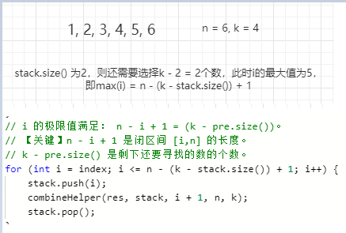

## leetcode

| 题目                                                         | 题解                                                         |
| ------------------------------------------------------------ | ------------------------------------------------------------ |
| [环形链表II](https://leetcode-cn.com/problems/linked-list-cycle-ii/) | [DetectCycle](https://github.com/Tyson0314/leetcode/blob/master/src/leetcode/DetectCycle.java) |
| [重排链表](https://leetcode-cn.com/problems/reorder-list/)   | [ReorderList](https://github.com/Tyson0314/leetcode/blob/master/src/leetcode/ReorderList.java) |
| [乘积最大子序列](https://leetcode-cn.com/problems/maximum-product-subarray/) | [MaxProduct](https://github.com/Tyson0314/leetcode/blob/master/src/leetcode/MaxProduct.java) |
| [版本比较](https://leetcode-cn.com/problems/compare-version-numbers/) | [CompareVersion](https://github.com/Tyson0314/leetcode/blob/master/src/leetcode/CompareVersion.java) |
| [最大数](https://leetcode-cn.com/problems/largest-number/)   | [LargestNumber](https://github.com/Tyson0314/leetcode/blob/master/src/leetcode/LargestNumber.java) |
| [最大正方形](https://leetcode-cn.com/problems/maximal-square/) | [MaximalSquare](https://github.com/Tyson0314/leetcode/blob/master/src/leetcode/MaximalSquare.java) |


## 整数反转

注意 int32 位溢出、正负号问题。

解法一：

```java
class Solution {
    public int reverse(int x) {
        long out = 0;

        while (x != 0) {
            out = out * 10 + x % 10;
            x /= 10;
            if (out > Integer.MAX_VALUE || out < Integer.MIN_VALUE) {
                return 0;
            }
        }
        return (int)out;
    }
}
```

解法二：

```java
class Solution {
    public int reverse(int x) {
        int out = 0;

        while (x != 0) {
            int tmp = x % 10;
            //先判断再做运算，防止溢出；注意正负号
            if (out > Integer.MAX_VALUE / 10 || (out == Integer.MAX_VALUE / 10 &&  tmp > Integer.MAX_VALUE % 10)) {
                return 0;
            } else if (out < Integer.MIN_VALUE / 10 || (out == Integer.MIN_VALUE / 10 && tmp < Integer.MIN_VALUE % 10 )) {
                return 0;
            }
            out = out * 10 + tmp;
            x /= 10;
        }

        return out;
    }
}
```


## 字符串转换整数

```
"4193 with words" 4193
"   -42" -42
"words and 987" 0
```

注意边界，空格，int 32位最大值最小值。

```java
class Solution {
    public int myAtoi(String str) {
        if (str == null || str.trim().length() == 0) {
            return 0;
        }
        str = str.trim();
        if (str.charAt(0) != '-' && str.charAt(0) != '+' &&
            !Character.isDigit(str.charAt(0))) {
                return 0;
        }
        boolean positive = str.charAt(0) == '-' ? false : true;
        int i = Character.isDigit(str.charAt(0)) ? 0 : 1;
        long out = 0;
        while (i < str.length() && Character.isDigit(str.charAt(i))) {
            out = out * 10 + (str.charAt(i++) - '0');
            if (positive && out > Integer.MAX_VALUE) {
                return Integer.MAX_VALUE;
            }
            if (!positive && out > 1L + Integer.MAX_VALUE) {
                return Integer.MIN_VALUE;
            }
        }

        return positive ? (int)out : (int)(-1 * out);
    }
}
```


## 回文数

将数字后半段反转，跟数字前半段相比即可。

```java
class Solution {
    public boolean isPalindrome(int x) {
        //排除负数和整十的数
        if (x < 0 || (x % 10 == 0 && x != 0)) {
            return false;
        }

        int reverseNum = 0;
        //反转x的后半段数字，再做比较即可
        while(x > reverseNum) {
            reverseNum = reverseNum * 10 + x % 10;
            x /= 10;
        }

        //x为奇数位时，转换后reverseNum会比x多一位
        //如x为1234321，转换后reverseNum为1234，x为123
        return x == reverseNum || x == reverseNum / 10;
    }
}
```


## 盛最多水的容器


左右指针，数字小的指针往数字大的指针移动，面积才有可能变大。注意左右指针数字相同的情况。

```java
class Solution {
    public int maxArea(int[] height) {
        int maxArea = 0;
        int left = 0;
        int right = height.length - 1;
        
        while(left < right) {
            maxArea = Math.max(maxArea, Math.min(height[left], height[right]) * (right - left));
            if(height[left] > height[right]) {
                right--;
            } else {
                left++;
            }
        }
        
        return maxArea;
    }
}
```


## 三数之和

先排序，双指针。注意去除重复三元组。


```java
class Solution {
    public List<List<Integer>> threeSum(int[] nums) {
        List<List<Integer>> res = new ArrayList<>();
        if (nums == null || nums.length < 3) {
            return res;
        }
        
        Arrays.sort(nums);
        for (int i = 0; i < nums.length - 2; i++) {
            if (nums[i] > 0) {
                return res;
            }
            if (i > 0 && nums[i] == nums[i - 1]) { //去重复
                continue;
            }
            int left = i + 1;
            int right = nums.length - 1;
            while (left < right) {
                int sum = nums[i] + nums[left] + nums[right];
                if (sum == 0) {
                    res.add(Arrays.asList(nums[i], nums[left], nums[right]));
                    while (left < right && nums[left] == nums[left + 1]) {
                        left++;//去重复
                    }
                    while (right > left && nums[right] == nums[right - 1]) {
                        right--;//去重复
                    }
                    left++;
                    right--;
                } else if (sum < 0) {
                    left++;
                } else {
                    right--;
                }
            }
        }

        return res;
    }
}
```


## 电话号码的组合

回溯是一种通过穷举所有可能情况来找到所有解的算法。如果一个候选解最后被发现并不是可行解，回溯算法会舍弃它，并在前面的一些步骤做出一些修改，并重新尝试找到可行解。

时间复杂度n3

```java
class Solution {
    private List<String> ans = new ArrayList<>();
    private String[] strs = {"abc", "def", "ghi", "jkl", "mno", "pqrs", "tuv", "wxyz"};
    public List<String> letterCombinations(String digits) {
        if (digits == null || digits.length() == 0) {
            return ans;
        }
        StringBuilder sb = new StringBuilder("");
        letterCombinationsHelper(sb, digits, 0);

        return ans;
    }

    private void letterCombinationsHelper(StringBuilder sb, String digits, int index) {
        if (index == digits.length()) {
            ans.add(sb.toString());
            return;
        }
        int num = digits.charAt(index) - '0' - 2;//数字2到9，对应strs下标0到7
        for (int i = 0; i < strs[num].length(); i++) {
            sb.append(strs[num].charAt(i));
            letterCombinationsHelper(sb, digits, index + 1);
            sb.deleteCharAt(sb.length() - 1);//function forgot，剪枝
        } 
    }
}
```


## 四数之和

时间复杂度n3

```java
class Solution {
    public List<List<Integer>> fourSum(int[] nums, int target) {
        List<List<Integer>> ans = new ArrayList<>();
        if (nums == null || nums.length < 4) {
            return ans;
        }
        int len = nums.length;

        Arrays.sort(nums);

        for (int i = 0; i < len; i++) {
            if (i > 0 && nums[i] == nums[i - 1]) { // forgot, 去重复
                continue;
            }
            for (int j = i + 1; j < len; j++) {
                if (j > i + 1 && nums[j] == nums[j - 1]) {//j大于i+1才去重复
                    continue;
                }
                int left = j + 1;
                int right = len - 1;
                while (left < right) {
                    int sum = nums[i] + nums[j] + nums[left] + nums[right];
                    if (sum == target) {
                        ans.add(Arrays.asList(nums[i], nums[j], nums[left], nums[right]));
                        while (left < right && nums[left] == nums[left + 1]) {
                            left++;//去重复
                        }
                        while (left < right && nums[right] == nums[right - 1]) {
                            right--;//去重复
                        }
                        left++;//forgot
                        right--;//forgot
                    } else if (sum < target) {
                        left++;
                    } else {
                        right--;
                    }
                }
            }
        }

        return ans;
    }
}
```


## 删除链表倒数第n个节点

使用快慢指针，快指针先走n步。给定的 *n* 保证是有效的。

```java
class Solution {
    public ListNode removeNthFromEnd(ListNode head, int n) {
        ListNode tmp = new ListNode(0); //技巧
        tmp.next = head;

        ListNode fast = tmp;
        ListNode slow = tmp;

        while (n-- > 0) {
            fast = fast.next;
        }

        while (fast.next != null) {
            fast = fast.next;
            slow = slow.next;
        }
        slow.next = slow.next.next;

        return tmp.next;
    }
}
```


## 有效的括号

使用栈实现。

```java
class Solution {
    public boolean isValid(String s) {
        Stack<Character> stack = new Stack<>();

        for (int i = 0; i < s.length(); i++) {
            switch (s.charAt(i)) {
                case '(':
                    stack.push(')');//存进相反符号
                    break;
                case '[':
                    stack.push(']');
                    break;
                case '{':
                    stack.push('}');
                    break;
                default:
                    if (stack.isEmpty() || s.charAt(i) != stack.pop()) {
                        return false;
                    }
                    break;
            }
        }
        return stack.isEmpty();
    }
}
```


## 括号生成

使用深度优先算法。

```java
class Solution {
    private List<String> ans = new ArrayList<>();

    public List<String> generateParenthesis(int n) {
        if (n <= 0) {
            return ans;
        }
        dfs("", n, n);

        return ans;
    }

    //left左括号剩下可用数目，right右括号剩下可用数目
    private void dfs(String s, int left, int right) {
        if (left > right || left < 0 || right < 0) {//右括号剩下的少，说明组合无效
            return;
        }

        if (left == 0 && right == 0) {
            ans.add(s);
        }

        dfs(s + "(", left - 1, right);
        dfs(s + ")", left, right - 1);
    }
}
```


## 两两交换链表中的节点

使用递归实现。

```java
class Solution {
    public ListNode swapPairs(ListNode head) {
        if (head == null) {
            return head;
        }
        ListNode left = head;
        ListNode right = head.next;

        if (right == null) {
            right = left;
        } else {
            left.next = swapPairs(right.next);
            right.next = left;
        }

        return right;
    }
}
```


## 合并两个有序列表

```java
class Solution {
    public ListNode mergeTwoLists(ListNode l1, ListNode l2) {
        ListNode ans = new ListNode(0);
        ListNode tmp = ans;

        while (l1 != null && l2!= null) {
            if (l1.val > l2.val) {
                tmp.next = l2; //tmp.next = new ListNode(l2.val); 没必要这么做
                l2 = l2.next;
            } else {
                tmp.next = l1;
                l1 = l1.next;
            }
            tmp = tmp.next;
        }

        tmp.next = l1 == null ? l2 : l1;

        return ans.next;
    }
}
```


## 删除排序数组的重复项

使用快慢指针。

```java
class Solution {
    public int removeDuplicates(int[] nums) {
        if (nums == null || nums.length <= 0) {
            return 0;
        }

        int slow = 0;
        for (int fast = 1; fast < nums.length; fast++) {
            if (nums[slow] != nums[fast]) {
                slow++;
                nums[slow] = nums[fast];
            }
        }

        return slow + 1;
    }
}
```


## 两数相除

Integer.MIN_VALUE 转为正数会溢出，故将 dividend 和 divisor 都转化为负数。**两个负数相加溢出会大于0。**

```java
class Solution {
    //dividend / divisor
    public int divide(int dividend, int divisor) {
        if (dividend == Integer.MIN_VALUE && divisor == -1) {
            return Integer.MAX_VALUE;
        }
        if (divisor == 1) { //不加上会超时
            return dividend;
        }
        int sign = 1;
        if ((dividend < 0 && divisor > 0) || (dividend > 0 && divisor < 0)) {
            sign = -1;
        }
        int a = dividend > 0 ? -dividend : dividend;
        int b = divisor > 0 ? -divisor : divisor;
        if (a > b) {
            return 0;
        }
        int ans = divideHelper(a, b);

        return sign > 0 ? ans : -ans;
    }

    private int divideHelper(int a, int b) {
        if (a > b) {
            return 0;
        }

        int count = 1;
        int tmp = b;
        while (tmp + tmp >= a && tmp + tmp < 0) { //两个负数相加溢出会大于0
            tmp += tmp;
            count += count;
        }

        return count + divideHelper(a - tmp, b);
    }
}
```


## 下一个排列

将给定数字序列重新排列成字典序中下一个更大的排列。如果不存在下一个更大的排列，则将数字重新排列成最小的排列（即升序排列）。

```
1,2,3 → 1,3,2
3,2,1 → 1,2,3
1,1,5 → 1,5,1
```

思路：

1、从后往前找到a[i-1] < a[i]；

2、找到a[j] > a[i - 1]> a[j - 1];

3、调换a[i - 1] 和 a[j] 位置；

4、翻转a[i]以后的数组；

特殊情况：数组降序排列，返回升序的数组。


```java
class Solution {
    public void nextPermutation(int[] nums) {
        if (nums == null || nums.length <= 1) {
            return;
        }
        int i = nums.length - 1;
        while (i > 0 && nums[i] <= nums[i - 1]) {//注意等号
            i--;
        }
        if (i == 0) {
            reverse(nums, 0);
            return;
        }
        int j = i;
        for (; j < nums.length; j++) {
            if (nums[i - 1] >= nums[j]) {//注意等号
                break;
            }
        }
        j--;//取前一个元素
        swap(nums, i - 1, j);
        reverse(nums, i);
    }

    public void swap(int[] nums, int i, int j) {
        int tmp = nums[i];
        nums[i] = nums[j];
        nums[j] = tmp;
    }

    public void reverse(int[] nums, int i) {
        int j = nums.length - 1;
        while (i < j) {
            swap(nums, i++, j--);
        }
    }
}
```


## 在排序数组中查找第一个和最后一个位置

给定一个按照升序排列的整数数组 `nums`，和一个目标值 `target`。找出给定目标值在数组中的开始位置和结束位置。算法时间复杂度必须是 *O*(log *n*) 级别。

```java
//输入: nums = [5,7,7,8,8,10], target = 8
//输出: [3,4]

class Solution {
    public int[] searchRange(int[] nums, int target) {
        if (nums == null || nums.length == 0) {
            return new int[]{-1, -1};
        }
        int left = searchRangeHelper(nums, target);
        int right = searchRangeHelper(nums, target + 1);//复用代码
        
        if (left == nums.length || nums[left] != target) {//left==nums.length数组元素比target小
            return new int[]{-1, -1};
        }
        return new int[]{left, right - 1};
    }

    private int searchRangeHelper(int[] nums, int target) {
        int left = 0;
        int right = nums.length;//特殊情况[1] 1
        while (left < right) {
            int mid = (left + right) >> 1;
            if (nums[mid] < target) {
                left = mid + 1;
            } else {
                right = mid;
            }
        }

        return left;
    }
}
```


## 组合总和

给定一个**无重复元素**的数组 `candidates` 和一个目标数 `target` ，找出 `candidates` 中所有可以使数字和为 `target` 的组合。

```
输入：candidates = [2,3,6,7], target = 7,
所求解集为：
[
  [7],
  [2,2,3]
]
```

数组元素可能重复。使用回溯算法。

剪枝：


去重复组合：


```java
class Solution {
    private List<List<Integer>> ans = new ArrayList<>();
    public List<List<Integer>> combinationSum2(int[] candidates, int target) {
        if (candidates == null || candidates.length == 0) {
            return ans;
        }
        Arrays.sort(candidates);//排序方便回溯剪枝
        Deque<Integer> path = new ArrayDeque<>();//作为栈来使用，效率高于Stack；也可以作为队列来使用，效率高于LinkedList；线程不安全
        combinationSum2Helper(candidates, target, 0, path);
        return ans;
    }

    public void combinationSum2Helper(int[] arr, int target, int start, Deque<Integer> path) {
        if (target == 0) {
            ans.add(new ArrayList(path));
        }

        for (int i = start; i < arr.length; i++) {
            if (target < arr[i]) {//剪枝
                return;
            }
            if (i > start && arr[i] == arr[i - 1]) {//在一个层级，会产生重复
                continue;
            }
            path.addLast(arr[i]);
            combinationSum2Helper(arr, target - arr[i], i + 1, path);
            path.removeLast();
        }
    }
}
```


## 移除元素

给你一个数组 *nums* 和一个值 *val*，你需要 **[原地](https://baike.baidu.com/item/原地算法)** 移除所有数值等于 *val* 的元素，并返回移除后数组的新长度。仅使用 O(1) 额外空间。

```
给定 nums = [0,1,2,2,3,0,4,2], val = 2,
函数应该返回新的长度 5, 并且 nums 中的前五个元素为 0, 1, 3, 0, 4。
```

前后双指针。

```java
class Solution {
    public int removeElement(int[] nums, int val) {
        if (nums == null || nums.length == 0) {
            return 0;
        }

        int start = 0;
        int end = nums.length - 1;
        while (start < end) {
            if (nums[start] == val) {
                nums[start] = nums[end];
                end--;
            } else {
                start++;
            }
        }
        return nums[start] == val ? start : start + 1;//需判断start处元素
    }
}
```


## 字符串相乘

参考自：https://leetcode-cn.com/problems/multiply-strings/solution/you-hua-ban-shu-shi-da-bai-994-by-breezean/


```java
class Solution {
    public String multiply(String num1, String num2) {
        if (num1.equals("0") || num2.equals("0")) { //乘0
            return "0";
        }
        int[] arr = new int[num1.length() + num2.length()];
        for (int i = num1.length() - 1; i >= 0; i--) {
            int m = num1.charAt(i) - '0';
            for (int j = num2.length() - 1; j >= 0; j--) {
                int n = num2.charAt(j) - '0';
                int sum = arr[i + j + 1] + m * n;
                arr[i + j + 1] = sum % 10;
                arr[i + j] += sum / 10; //+=，不能忘了原先的数
            }
        }

        StringBuilder ans = new StringBuilder("");
        if (arr[0] != 0) {
            ans.append(arr[0]);
        }
        for (int i = 1; i < arr.length; i++) {
            ans.append(arr[i]);
        }
        
        return ans.toString();
    }
}
```


## 有效的数独

判断一个 9x9 的数独是否有效。只需要根据以下规则，验证已经填入的数字是否有效即可。

数字 1-9 在每一行只能出现一次。
数字 1-9 在每一列只能出现一次。
数字 1-9 在每一个以粗实线分隔的 3x3 宫内只能出现一次。

关键在于找到子数独的规律：`box_index = (row / 3) * 3 + columns / 3`


```java
class Solution {
    public boolean isValidSudoku(char[][] board) {
        int[][] row = new int[9][9]; //二维数组初始化
        int[][] column = new int[9][9];
        int[][] box = new int[9][9];

        for (int i = 0; i < 9; i++) {
            for (int j = 0; j < 9; j++) {
                if (board[i][j] == '.') {
                    continue;
                }
                int num = board[i][j] - '1';//数字1-9对应下标0-8
                int boxIndex = (i/3)*3 + j/3;

                if (row[i][num] > 0 || column[j][num] > 0 || box[boxIndex][num] > 0) {
                    return false;
                }

                row[i][num] = 1;
                column[j][num] = 1;
                box[boxIndex][num] = 1;

            }
        }

        return true;
    }
}
```


## 全排列

给定一个 **没有重复** 数字的序列，返回其所有可能的全排列。

```
输入: [1,2,3]
输出:
[
  [1,2,3],
  [1,3,2],
  [2,1,3],
  [2,3,1],
  [3,1,2],
  [3,2,1]
]
```

回溯。注意与组合总和的区别（数字有无顺序）。

```java
class Solution {
    private List<List<Integer>> ans = new ArrayList<>();
    public List<List<Integer>> permute(int[] nums) {
        boolean[] flag = new boolean[nums.length];
        ArrayDeque<Integer> path = new ArrayDeque<>();
        permuteHelper(nums, flag, path);

        return ans;
    }

    private void permuteHelper(int[] nums, boolean[] flag, ArrayDeque<Integer> path) {
        if (path.size() == nums.length) {
            ans.add(new ArrayList<>(path));
            return;
        }
        for (int i = 0; i < nums.length; i++) {
            if (flag[i]) {
                continue;//继续循环
            }
            path.addLast(nums[i]);
            flag[i] = true;
            permuteHelper(nums, flag, path);
            path.removeLast();
            flag[i] = false;
        }
    }
}
```


## 全排列II

给定一个可包含重复数字的序列，返回所有不重复的全排列。注意与组合总和的区别。

1、排序；2、同一层级相同元素剪枝。参考自：https://leetcode-cn.com/problems/permutations-ii/solution/hui-su-suan-fa-python-dai-ma-java-dai-ma-by-liwe-2/


```java
class Solution {
    private List<List<Integer>> ans = new ArrayList<>();
    public List<List<Integer>> permuteUnique(int[] nums) {
        if (nums == null || nums.length == 0) {
            return ans;
        }
        ArrayDeque<Integer> path = new ArrayDeque<>();
        boolean[] used = new boolean[nums.length];
        Arrays.sort(nums);//切记
        dps(nums, used, path);

        return ans;
    }

    private void dps(int[] nums, boolean[] used, ArrayDeque<Integer> path) {
        if (path.size() == nums.length) {
            ans.add(new ArrayList<>(path));
            return;
        }
        for (int i = 0; i < nums.length; i++) {
            if (used[i]) {
                continue;
            }
            if ((i > 0 && nums[i] == nums[i - 1]) && !used[i - 1]) {//同一层相同的元素，剪枝
                continue;//继续循环，不是return退出循环
            }
            path.addLast(nums[i]);
            used[i] = true;
            dps(nums, used, path);
            path.removeLast();
            used[i] = false;
        }
    }
}
```


## 实现 strStr()

给定一个 haystack 字符串和一个 needle 字符串，在 haystack 字符串中找出 needle 字符串出现的第一个位置 (从0开始)。如果不存在，则返回  -1。

kmp算法，参考自：https://leetcode-cn.com/problems/implement-strstr/solution/kmp-suan-fa-xiang-jie-by-labuladong/

```java
class Solution {
    public int strStr(String haystack, String needle) {
        if (needle.equals("")) {
            return 0;
        }
        if (needle.length() > haystack.length()) {
            return -1;
        }
        int len = needle.length();
        int[][] next = new int[len][256];
        next[0][needle.charAt(0)] = 1;
        int X = 0;
        //构建状态转移图
        for (int i = 1; i < len; i++) {
            for (int c = 0; c < 256; c++) {
                if (needle.charAt(i) == c) {
                    next[i][c] = i + 1;//推进状态
                } else {
                    next[i][c] = next[X][c];
                }
            }
            X = next[X][needle.charAt(i)];//更新影子状态
        }

        int m = 0;//needle初始态
        for (int i = 0; i < haystack.length(); i++) {
            m = next[m][haystack.charAt(i)];//计算needle下一状态
            //到达终止态
            if (m == len) {
                return i - len + 1;
            }
        }

        return -1;
    }
}
```


## 字母异位词分组


```java
class Solution {
    public List<List<String>> groupAnagrams(String[] strs) {
        if (strs == null || strs.length == 0) {
            return new ArrayList();
        }

        Map<String, List> ans = new HashMap<>();
        for (String s : strs) {
            char[] arr = s.toCharArray();
            Arrays.sort(arr);
            String key = String.valueOf(arr);
            if (!ans.containsKey(key)) {
                ans.put(key, new ArrayList());
            }
            ans.get(key).add(s);
        }

        return new ArrayList(ans.values());//没有<>
    }
}
```


## pow(x, n)

快速幂算法。

```java
class Solution {
    public double myPow(double x, int n) {
        if (n == 0) {
            return 1.0;
        }
        if (n == -1) {//负数边界
            return 1 / x;
        }
        double res = myPow(x, n / 2);
        double ans = 0;
        if (n % 2 == 0) {
            ans = res * res;
        } else {
            ans = n > 0 ? res * res * x : res * res / x;
        }

        return ans;
    }
}
```


## 旋转图像

给定一个 *n* × *n* 的二维矩阵表示一个图像。将图像顺时针旋转 90 度。

先转置，然后翻转每一行。

```java
class Solution {
    public void rotate(int[][] matrix) {
        if (matrix == null || matrix.length <= 1) {
            return;
        }
        //转置
        for (int i = 0; i < matrix.length; i++) {
            for (int j = i + 1; j < matrix.length; j++) {
                int tmp = matrix[i][j];
                matrix[i][j] = matrix[j][i];
                matrix[j][i] = tmp;
            }
        }
        //翻转每一行
        for (int i = 0; i < matrix.length; i++) {
            for (int j = 0; j < matrix.length / 2; j++) {
                int tmp = matrix[i][j];
                matrix[i][j] = matrix[i][matrix.length - j - 1];
                matrix[i][matrix.length - j - 1] = tmp;
            }
        }
    }
}
```


## 跳跃游戏

给定一个非负整数数组，你最初位于数组的第一个位置。数组中的每个元素代表你在该位置可以跳跃的最大长度。判断你是否能够到达最后一个位置。

贪心算法。

```java
class Solution {
    public boolean canJump(int[] nums) {
        if (nums == null || nums.length == 0) {
            return true;
        }

        int maxIndex = nums[0];
        for (int i = 1; i < nums.length; i++) {
            if (maxIndex >= i) {
                maxIndex = Math.max(maxIndex, i + nums[i]);
            } else {
                return false;
            }
        }

        return true;
    }
}
```


## 螺旋矩阵

```
输入:
[
 [ 1, 2, 3 ],
 [ 4, 5, 6 ],
 [ 7, 8, 9 ]
]
输出: [1,2,3,6,9,8,7,4,5]
```

定义上下左右四个边界。注意边界判断。

```java
class Solution {
    public List<Integer> spiralOrder(int[][] matrix) {
        List<Integer> ans = new ArrayList<>();
        if (matrix == null || matrix.length == 0) {
            return ans;
        }
        int top = 0;
        int bottom = matrix.length - 1;
        int left = 0;
        int right = matrix[0].length - 1;
        while (true) {
            for (int i = left; i <= right; i++) {
                ans.add(matrix[top][i]);
            }
            if (++top > bottom) {
                break;
            }
            for (int j = top; j <= bottom; j++) {
                ans.add(matrix[j][right]);
            }
            if (--right < left) {
                break;
            }
            for (int m = right; m >= left; m--) {
                ans.add(matrix[bottom][m]);
            }
            if (--bottom < top) {
                break;
            }
            for (int n = bottom; n >= top; n--) {
                ans.add(matrix[n][left]);
            }
            if (++left > right) {
                break;
            }
        }

        return ans;
    }
}
```


## 合并区间

给出一个区间的集合，请合并所有重叠的区间。

```
输入: intervals = [[1,3],[2,6],[8,10],[15,18]]
输出: [[1,6],[8,10],[15,18]]
解释: 区间 [1,3] 和 [2,6] 重叠, 将它们合并为 [1,6].
```

先对区间左边界排序 `Array.sort(arr, (i1, i2) -> i1[0] - i2[0])`，然后新建数组进行合并。

```java
class Solution {
    public int[][] merge(int[][] intervals) {
        if (intervals == null || intervals.length == 0) {
            throw new IllegalArgumentException("array is null or array is empty");
        }
        Arrays.sort(intervals, (i1, i2) -> i1[0] - i2[0]);//返回值是int
        int[][] ans = new int[intervals.length][2];
        ans[0] = intervals[0];
        int index = 0;
        for (int i = 1; i < intervals.length; i++) {
            if (intervals[i][0] > ans[index][1]) {
                ans[++index] = intervals[i];
            } else {
                ans[index][1] = Math.max(ans[index][1], intervals[i][1]);
            }
        }

        return Arrays.copyOf(ans, index + 1);//第二个参数是数组长度
    }
}
```


## 螺旋矩阵II

给定一个正整数 *n*，生成一个包含 1 到 *n*2 所有元素，且元素按顺时针顺序螺旋排列的正方形矩阵。

```
输入: 3
输出:
[
 [ 1, 2, 3 ],
 [ 8, 9, 4 ],
 [ 7, 6, 5 ]
]
```

定义上下左右边界。

```java
class Solution {
    public int[][] generateMatrix(int n) {
        int left = 0;
        int right = n - 1;
        int top = 0;
        int bottom = n - 1;
        
        int[][] ans = new int[n][n];
        int num = 1;
        while (true) {
            for (int i = left; i <= right; i++) {
                ans[top][i] = num++;//注意下标顺序
            }
            if (++top > bottom) {
                break;
            }
            for (int j = top; j <= bottom; j++) {
                ans[j][right] = num++;
            }
            if (--right < left) {
                break;
            }
            for (int m = right; m >= left; m--) {
                ans[bottom][m] = num++;
            }
            if (--bottom < top) {
                break;
            }
            for (int k = bottom; k >= top; k--) {
                ans[k][left] = num++;
            }
            if (++left > right) {
                break;
            }
        }
        return ans;
    }
}
```


## 第 k 个排列

给出集合 [1,2,3,…,n]，其所有元素共有 n! 种排列。

按大小顺序列出所有排列情况，并一一标记，当 n = 3 时, 所有排列如下：

"123"
"132"
"213"
"231"
"312"
"321"
给定 n 和 k，返回第 k 个排列。

[参考代码](https://leetcode-cn.com/problems/permutation-sequence/comments/)

```java
class Solution {
            /**
        直接用回溯法做的话需要在回溯到第k个排列时终止就不会超时了, 但是效率依旧感人
        可以用数学的方法来解, 因为数字都是从1开始的连续自然数, 排列出现的次序可以推
        算出来, 对于n=4, k=15 找到k=15排列的过程:
        
        1 + 对2,3,4的全排列 (3!个)         
        2 + 对1,3,4的全排列 (3!个)         3, 1 + 对2,4的全排列(2!个)
        3 + 对1,2,4的全排列 (3!个)-------> 3, 2 + 对1,4的全排列(2!个)-------> 3, 2, 1 + 对4的全排列(1!个)-------> 3214
        4 + 对1,2,3的全排列 (3!个)         3, 4 + 对1,2的全排列(2!个)         3, 2, 4 + 对1的全排列(1!个)
        
        确定第一位:
            k = 14(从0开始计数)
            index = k / (n-1)! = 2, 说明第15个数的第一位是3 
            更新k
            k = k - index*(n-1)! = 2
        确定第二位:
            k = 2
            index = k / (n-2)! = 1, 说明第15个数的第二位是2
            更新k
            k = k - index*(n-2)! = 0
        确定第三位:
            k = 0
            index = k / (n-3)! = 0, 说明第15个数的第三位是1
            更新k
            k = k - index*(n-3)! = 0
        确定第四位:
            k = 0
            index = k / (n-4)! = 0, 说明第15个数的第四位是4
        最终确定n=4时第15个数为3214 
        **/
    public String getPermutation(int n, int k) {
        StringBuilder sb = new StringBuilder();
        List<Integer> candidates = new ArrayList<>();
        //阶乘
        int[] arr = new int[n + 1];
        arr[0] = 1;
        for (int i = 1; i < n + 1; i++) {
            candidates.add(i);
            arr[i] = arr[i - 1] * i;
        }

        k--;
        for (int j = n - 1; j >= 0; j--) {
            int index = k / arr[j];
            k -= arr[j] * index;
            sb.append(candidates.remove(index));
        }

        return sb.toString();
    }
}
```


## 简化路径

返回的规范路径必须始终以斜杠 / 开头，并且两个目录名之间必须只有一个斜杠 /。最后一个目录名（如果存在）不能以 / 结尾。此外，规范路径必须是表示绝对路径的最短字符串。

使用栈实现。

```java
//输入："/a/./b/../../c/"
//输出："/c"
class Solution {
    public String simplifyPath(String path) {
        Stack<String> stack = new Stack<>();
        String[] strs = path.split("/");

        for (String s : strs) {
            if ("..".equals(s)) {
                if (!stack.isEmpty()) {
                    stack.pop();
                }
                continue;//只要是".."，就执行下一个循环，不能放入栈
            }
            if (!"".equals(s) && !".".equals(s)) {
                stack.push(s);
            }
        }

        if (stack.isEmpty()) {
            return "/";
        }

        StringBuilder sb = new StringBuilder();
        int size = stack.size();
        for (int i = 0; i < size; i++) {
            sb.append("/").append(stack.get(i));//tips
        }
        return sb.toString();
    }
}
```


## 矩阵置零

给定一个 *m* x *n* 的矩阵，如果一个元素为 0，则将其所在行和列的所有元素都设为 0。请使用**[原地](http://baike.baidu.com/item/原地算法)**算法。

[参考解法](https://leetcode-cn.com/problems/set-matrix-zeroes/solution/ju-zhen-zhi-ling-by-leetcode/)

1. 遍历整个矩阵，如果 cell[i][j] == 0 就将第 i 行和第 j 列的第一个元素标记。
2. 第一行和第一列的标记是相同的，都是 cell[0][0]，所以需要一个额外的变量告知第一列是否被标记，同时用 cell[0][0] 继续表示第一行的标记。
3. 然后，从第二行第二列的元素开始遍历，如果第 r 行或者第 c 列被标记了，那么就将 cell[r][c] 设为 0。这里第一行和第一列的作用就相当于方法一中的 row_set 和 column_set 。
4. 然后我们检查是否 cell[0][0] == 0 ，如果是则赋值第一行的元素为零。
5. 然后检查第一列是否被标记，如果是则赋值第一列的元素为零。

```java
class Solution {
    public void setZeroes(int[][] matrix) {
        if (matrix == null || matrix.length == 0) {
            return;
        }
        boolean isCol = false;
        int rows = matrix.length;
        int cols = matrix[0].length;

        for (int i = 0; i < rows; i++) {
            if (matrix[i][0] == 0) {
                isCol = true;
            }
            for (int j = 1; j < cols; j++) {
                if (matrix[i][j] == 0) {
                    matrix[i][0] = 0;
                    matrix[0][j] = 0;
                }
            }
        }

        for (int i = 1; i < rows; i++) {
            for (int j = 1; j < cols;j++) {
                if (matrix[i][0] == 0 || matrix[0][j] == 0) {
                    matrix[i][j] = 0;
                }
            }
        }

        if (matrix[0][0] == 0) {//顺序
            for (int j = 0; j < cols; j++) {
                matrix[0][j] = 0;
            }
        }

        if (isCol) {//顺序
            for (int i = 0; i < rows; i++) {
                matrix[i][0] = 0;
            }
        }
    }
}
```


## 搜索二维矩阵

- 每行中的整数从左到右按升序排列。
- 每行的第一个整数大于前一行的最后一个整数。

```java
class Solution {
    public boolean searchMatrix(int[][] matrix, int target) {
        if (null == matrix || matrix.length == 0 || matrix[0].length == 0) {
            return false;
        }
        int rows = matrix.length;
        int cols = matrix[0].length;
        int left = 0;
        int right = rows * cols - 1;

        while (left <= right) {
            int mid = (left + right) >> 1; //!
            int val = matrix[mid / cols][mid % cols]; //cols!不是rows
            if (target == val) {
                return true;
            } else if (target > val) {
                left = mid + 1;
            } else {
                right = mid - 1;
            }
        }

        return false;
    }
}
```


## 颜色分类

给定一个包含红色、白色和蓝色，一共 *n* 个元素的数组，**[原地](https://baike.baidu.com/item/原地算法)**对它们进行排序，使得相同颜色的元素相邻，并按照红色、白色、蓝色顺序排列。

三指针。

```java
class Solution {
    public void sortColors(int[] nums) {
        if (nums == null || nums.length == 0) {
            return;
        }
        int p1 = 0, cur = 0, p2 = nums.length - 1;
        while (cur <= p2) { //边界，nums全为1的情况
            if (nums[cur] == 0) {
                int tmp = nums[p1];
                nums[p1++] = 0;
                nums[cur++] = tmp; //cur++
            } else if (nums[cur] == 2) {
                int tmp = nums[p2];
                nums[p2--] = 2;
                nums[cur] = tmp; //nums[cur]可能为2，不自增
            } else {
                cur++;
            }
        }
    }
}
```


## 组合

给定两个整数 *n* 和 *k*，返回 1 ... *n* 中所有可能的 *k* 个数的组合。回溯。剪枝优化。



```java
class Solution {
    public List<List<Integer>> combine(int n, int k) {
        List<List<Integer>> res = new ArrayList<>();
        if (n <= 0 || k <= 0 || n < k) {
            return res;
        }
        Stack<Integer> stack = new Stack<>();
        combineHelper(res, stack, 1, n, k);
        return res;
    }

    public void combineHelper(List<List<Integer>> res, Stack<Integer> stack, int index,int n, int k) {
        if (stack.size() == k) {
            res.add(new ArrayList<>(stack));
            return;
        }
        // i 的极限值满足： n - i + 1 = (k - pre.size())。
        // 【关键】n - i + 1 是闭区间 [i,n] 的长度。
        // k - pre.size() 是剩下还要寻找的数的个数。
        for (int i = index; i <= n - (k - stack.size()) + 1; i++) {
            stack.push(i);
            combineHelper(res, stack, i + 1, n, k);
            stack.pop();
        }
    }
}
```


## 子集

给定一组不含重复元素的整数数组 *nums*，返回该数组所有可能的子集。解集不能包含重复的子集。

回溯。

```java
class Solution {
    public List<List<Integer>> subsets(int[] nums) {
        List<List<Integer>> res = new ArrayList<>();
        if (nums == null || nums.length == 0) {
            res.add(new ArrayList<>()); //空集
            return res;
        }
        Stack<Integer> queue = new Stack<>();
        subsetsHelper(res, queue, 0, nums);

        return res;
    }

    public void subsetsHelper(List<List<Integer>> res, Stack<Integer> queue, int index, int[] nums) {
        res.add(new ArrayList<>(queue));
        
        for (int i = index; i < nums.length; i++) {
            queue.push(nums[i]);
            subsetsHelper(res, queue, i + 1, nums);
            queue.pop();
        }
    }
}
```


## 单词搜索

给定一个二维网格和一个单词，找出该单词是否存在于网格中。

```java
board =
[
  ['A','B','C','E'],
  ['S','F','C','S'],
  ['A','D','E','E']
]

给定 word = "ABCCED", 返回 true
给定 word = "SEE", 返回 true
给定 word = "ABCB", 返回 false
```

注意避免同一元素多次使用（[A B C]，A->B->A）。

```java
class Solution {
    public boolean exist(char[][] board, String word) {
        if (board == null || board.length == 0 || board[0].length == 0) {
            return false;
        }
        for (int i = 0; i < board.length; i++){
            for (int j = 0; j < board[0].length; j++) {
                if (existHelper(board, i, j, word, 0)) {
                    return true;
                }
            }
        }
        return false;
    }

    private boolean existHelper(char[][] board, int row, int col, String word, int index) {
        if (index == word.length()) {
            return true;
        }
        if (row < 0 || col < 0 || row >= board.length || col >= board[0].length || board[row][col] != word.charAt(index)) {
            return false;
        }
        if (board[row][col] == word.charAt(index)) {
            index++;
        }
        char tmp = board[row][col];
        board[row][col] = '#'; //防止回溯自身
        boolean result = existHelper(board, row - 1, col, word, index) ||
                existHelper(board, row + 1, col, word, index) || 
                existHelper(board, row, col - 1, word, index) ||
                existHelper(board, row, col + 1, word, index);
        board[row][col] = tmp;
        return result;
    }
}
```


## 删除排序数组的重复项

给定一个排序数组，你需要在**[原地](http://baike.baidu.com/item/原地算法)**删除重复出现的元素，使得每个元素最多出现两次，返回移除后数组的新长度。双指针。

```java
class Solution {
    public int removeDuplicates(int[] nums) {
        if (nums == null || nums.length == 0) {
            return 0;
        }
        int left = 0;
        int right = 1;
        int count = 1;

        while (right < nums.length) {
            if (nums[right] == nums[left]) {
                if (count < 2) {
                    nums[++left] = nums[right++];
                } else {
                    right++;
                }
                count++;
            } else {
                count = 1;
                nums[++left] = nums[right++];
            }
        }
        return left + 1;
    }
}
```


## 搜索旋转排序数组II

假设按照升序排序的数组在预先未知的某个点上进行了旋转。编写一个函数来判断给定的目标值是否存在于数组中。

```java
class Solution {
    public boolean search(int[] nums, int target) {
        if (nums == null || nums.length == 0) {
            return false;
        }

        int left = 0;
        int right = nums.length - 1;
        
        while (left <= right) {
            int mid = (left + right) >> 1;
            if (nums[mid] == target) {
                return true;
            }
            if (nums[left] < nums[mid]) {
                if (target >= nums[left] && target <= nums[mid]) {
                    right = mid - 1;
                } else {
                    left = mid + 1;
                }
            } else if (nums[mid] < nums[right]) {
                if (target >= nums[mid] && target <= nums[right]) {
                    left = mid + 1;
                } else {
                    right = mid - 1;
                }
            } else {
                if (nums[left] == nums[mid]) { //[3,1,1] 3
                    left++;
                } else {
                    right--;
                }
            }
        }

        return false;
    }
}
```


## 删除排序链表的重复元素

```java
class Solution {
    public ListNode deleteDuplicates(ListNode head) {
        if (head == null || head.next == null) {
            return head;
        }

        ListNode pre = head, cur = head.next;
        while (cur != null) {
            if (cur.val == pre.val) {
                cur = cur.next;
                continue;
            }
            pre.next = cur;
            cur = cur.next;
            pre = pre.next;
        }

        pre.next = null; //末尾相同元素，断开尾巴 [1,1,2,3,3]

        return head;
    }
}
```


## 分隔链表

哑节点；断尾，避免环形链表。

```java
class Solution {
    public ListNode partition(ListNode head, int x) {
        if (head == null || head.next == null) {
            return head;
        }

        ListNode left = new ListNode(0); //哑节点
        ListNode right = new ListNode(0);
        ListNode leftTmp = left, rightTmp = right;
        while (head != null) {
            if (head.val < x) {
                leftTmp.next = head;
                leftTmp = leftTmp.next;
            } else {
                rightTmp.next = head;
                rightTmp = rightTmp.next;
            }
            head = head.next;
        }
        rightTmp.next = null; //断开尾巴，防止链表成环
        leftTmp.next = right.next;
        return left.next;
    }
}
```


## 格雷编码

[参考解法](https://leetcode-cn.com/problems/gray-code/solution/gray-code-jing-xiang-fan-she-fa-by-jyd/)

```java
class Solution {
    public List<Integer> grayCode(int n) {
        List<Integer> res = new ArrayList<>();
        res.add(0);
        int head = 1;
        for (int i = 0; i < n; i++) {
            for (int j = res.size() - 1; j >= 0; j--) {
                res.add(head + res.get(j));
            }
            head <<= 1;
        }
        return res;
    }
}
```


## 不同的二叉搜索树

给定一个整数 *n*，求以 1 ... *n* 为节点组成的二叉搜索树有多少种？

[动态规划解法](https://leetcode-cn.com/problems/unique-binary-search-trees/solution/bu-tong-de-er-cha-sou-suo-shu-by-leetcode/)

```java
class Solution {
    public int numTrees(int n) {
        int arr[] = new int[n + 1];
        arr[0] = 1;
        arr[1] = 1;
        int sum = 0;

        for (int i = 2; i <= n; i++) {
            for (int j = 1; j <= i; j++) {
                arr[i] += arr[j - 1] * arr[i - j];
            }
        }

        return arr[n];
    }
}
```

## 子集II

给定一个可能包含重复元素的整数数组 ***nums***，返回该数组所有可能的子集（幂集）。

```java
class Solution {
    private List<List<Integer>> res = new ArrayList<>();
    public List<List<Integer>> subsetsWithDup(int[] nums) {
        Arrays.sort(nums);
        Stack<Integer> subset = new Stack<>();
        subsetsWithDupHelper(nums, 0, subset);
        return res;
    }

    private void subsetsWithDupHelper(int[] nums, int index, Stack<Integer> subset) {
        res.add(new ArrayList<>(subset));
        if (index >= nums.length) {
            return;
        }
        for (int i = index; i < nums.length; i++) {
            if (i > index && nums[i] == nums[i - 1]) { //i > index
                continue;
            }
            subset.push(nums[i]);
            subsetsWithDupHelper(nums, i + 1, subset);
            subset.pop();
        }
    }
}
```

## 解码方法

https://leetcode-cn.com/problems/decode-ways/

```java
class Solution {
    public int numDecodings(String s) {
        char[] arr = s.toCharArray();
        if (arr[0] == '0') {
            return 0;
        }

        int cur = 1;
        int pre = 1;
        for (int i = 1; i < arr.length; i++) {
            int tmp = cur;
            if (arr[i] == '0') {
                if (arr[i - 1] == '1' || arr[i - 1] == '2') {
                    cur = pre;
                } else {
                    return 0;
                }
            } else if (arr[i - 1] == '1' || (arr[i - 1] == '2' && arr[i] >= '0' && arr[i] <= '6')) {
                cur += pre;
            }
            pre = tmp;
        }

        return cur;
    }
}
```


## 反转链表

```java
class Solution {
    public ListNode reverseList(ListNode head) {
        if (head == null) {
            return null;
        }

        ListNode pre = null;
        ListNode cur = head;
        ListNode tmp = null;
        while (cur != null) {
            tmp = cur.next;
            cur.next = pre;
            pre = cur;
            cur = tmp;
        }

        return pre;
    }
}
```


## 反转链表II

反转从位置 *m* 到 *n* 的链表。请使用一趟扫描完成反转。头插法。

```java
class Solution {
    public ListNode reverseBetween(ListNode head, int m, int n) {
        ListNode dummy = new ListNode(0);
        dummy.next = head;
        ListNode pre = dummy;
        for (int i = 1; i < m; i++) {
            pre = pre.next;
        }
        head = pre.next;
        for (int i = m; i < n; i++) {
            ListNode cur = head.next;
            head.next = cur.next;
            cur.next = pre.next;
            pre.next = cur;
        }

        return dummy.next;
    }
}
```


## 复原ip

```java
class Solution {
    List<String> res = new ArrayList<>();
    public List<String> restoreIpAddresses(String s) {
        dfs(s, 0, 0, new StringBuilder());
        return res;
    }

    private void dfs(String s, int start, int ipIndex, StringBuilder sb) {
        if (ipIndex == 4) {
            if (start == s.length()) {
                res.add(sb.substring(0, sb.length() - 1).toString());
            }
            return; //长度为4则返回
        }
        for (int i = start; i < start + 3 && i < s.length(); i++) {
            String subStr = s.substring(start, i + 1);
            int num = Integer.parseInt(subStr);
            if (num > 255) {
                return;
            }
            sb.append(subStr).append(".");
            dfs(s, i + 1, ipIndex + 1, sb);
            sb.delete(sb.length() - (i - start + 2), sb.length());
            if(s.charAt(start) == '0') { //允许0.0.0.0，其他以0开头的剪枝
                return;
            }
        }
    }
}
```


## 对称的二叉树

```java
class Solution {
    public boolean isSymmetric(TreeNode root) {
        return isMirror(root, root);
    }

    private boolean isMirror(TreeNode node1, TreeNode node2) {
        if (node1 == null && node2 == null) {
            return true;
        }
        if (node1 == null || node2 == null) {
            return false;
        }
        return (node1.val == node2.val)
            && isMirror(node1.left, node2.right)
            && isMirror(node1.right, node2.left);
    }
}
```


## 二叉树锯齿形层次遍历

使用两个栈实现。

```java
class Solution {
    public List<List<Integer>> zigzagLevelOrder(TreeNode root) {
        List<List<Integer>> res = new ArrayList<>();
        if (root == null) {
            return res;
        }
        Stack<TreeNode> s1 = new Stack<>();
        Stack<TreeNode> s2 = new Stack<>();
        s1.push(root);
        boolean reverse = false;

        while (!s1.isEmpty() || !s2.isEmpty()) {
            List<Integer> list = new LinkedList<>();
            TreeNode node;
            if (!s1.isEmpty()) {
                while (!s1.isEmpty()) {
                    node = s1.pop();
                    list.add(node.val);
                    if (node.left != null) {
                        s2.push(node.left);
                    }
                    if (node.right != null) {
                        s2.push(node.right);
                    }
                }
            } else {
                while (!s2.isEmpty()) {
                    node = s2.pop();
                    list.add(node.val);
                    if (node.right != null) {
                        s1.push(node.right);
                    }
                    if (node.left != null) {
                        s1.push(node.left);
                    }
                }
            }
            res.add(list);
        }

        return res;
    }
}
```


## 从前序与中序遍历序列构造二叉树

使用 map 存放下标。

```java
class Solution {
    Map<Integer, Integer> map = new HashMap<>();
    public TreeNode buildTree(int[] preorder, int[] inorder) {
        if (preorder == null || preorder.length == 0) {
            return null;
        }

        for (int i = 0; i < inorder.length; i++) {
            map.put(inorder[i], i);
        }
        
        return buildTreeHelper(preorder, 0, preorder.length - 1, inorder, 0, inorder.length - 1);
    }

    public TreeNode buildTreeHelper(int[] preorder, int pStart, int pEnd, int[] inorder, int iStart, int iEnd) {
        if (preorder == null || preorder.length == 0 || pStart > pEnd) {
            return null;
        }
        TreeNode root = new TreeNode(preorder[pStart]);
        int index = map.get(preorder[pStart]);
        int leftNum = index - iStart;

        root.left = buildTreeHelper(preorder, pStart + 1, pStart + leftNum, inorder, iStart, index - 1);
        root.right = buildTreeHelper(preorder, pStart + leftNum + 1, pEnd, inorder, index + 1, iEnd);
        return root;
    }
}
```


## 将有序数组转换为二叉搜索树

只返回一个可能的答案。

```java
class Solution {
    public TreeNode sortedArrayToBST(int[] nums) {
        if (nums == null) {
            return null;
        }

        return buildTree(nums, 0, nums.length - 1);
    }

    public TreeNode buildTree(int[] nums, int left, int right) {
        if (left > right) {
            return null;
        }

        int mid = (left + right) >> 1;
        TreeNode root = new TreeNode(nums[mid]);
        root.left = buildTree(nums, left, mid - 1);
        root.right = buildTree(nums, mid + 1, right);

        return root;
    }
}
```


## 有序链表转换二叉搜索树

快慢指针。

```java
class Solution {
    public TreeNode sortedListToBST(ListNode head) {
        if (head == null) {
            return null;
        }
        ListNode mid = locateMidNode(head);
        TreeNode root = new TreeNode(mid.val);
        
        if (mid == head) {
            return root;
        }

        root.left = sortedListToBST(head);
        root.right = sortedListToBST(mid.next);

        return root;
    }

    public ListNode locateMidNode(ListNode node) {
        ListNode pre = null;
        ListNode slow = node;
        ListNode fast = node;

        while (fast != null && fast.next != null) {
            pre = slow;
            slow = slow.next;
            fast = fast.next.next;
        }
        
        if (pre != null) {
            pre.next = null;//从中点的前一个节点断开链表
        }

        return slow;
    }
}
```


## 平衡二叉树

递归解法。

```java
class Solution {
    public boolean isBalanced(TreeNode root) {
        return height(root) != -1;
    }

    private int height(TreeNode root) {
        if (root == null) {
            return 0;
        }

        int left = height(root.left);
        int right = height(root.right);

        if (left < 0 || right < 0 || Math.abs(left - right) > 1) {
            return -1;
        }

        return Math.max(left, right) + 1;
    }
}
```


## 二叉树的最小深度

注意当左子树或者右子树不存在的情况，如[1, 2]。

```java
class Solution {
    public int minDepth(TreeNode root) {
        if (root == null) {
            return 0;
        }
        int left = minDepth(root.left);
        int right = minDepth(root.right);
        return (root.left == null || root.right == null) ? left + right + 1 : Math.min(left, right) + 1; //[1, 2]
    }
}
```


## 二叉树展开为链表

```java
    1
   / \
  2   5
 / \   \
3   4   6

//找到 1 的左子树2的最右节点a，1 的右子树作为a的右子树
    1
   /
  2        
 / \        
3   4    
     \
       5
        \
         6
//左子树变右子树
    1
     \
      2          
     / \          
    3   4  
         \
          5
           \
            6
            
 //找到3的最右节点，2的右子树变成3的右子树
    1
     \
      2          
     /       
    3 
      \
        4  
         \
          5
           \
            6  
//2的左子树变成2的右子树
```

[参考题解](https://leetcode-cn.com/problems/flatten-binary-tree-to-linked-list/solution/xiang-xi-tong-su-de-si-lu-fen-xi-duo-jie-fa-by--26/)

```java
class Solution {
    public void flatten(TreeNode root) {
        while (root != null) {
            if (root.left == null) {
                root = root.right;
            } else {
                TreeNode tmp = root.left;
                while (tmp.right != null) {
                    tmp = tmp.right;
                }
                tmp.right = root.right;
                root.right = root.left;
                root.left = null;
                root = root.right;
            }
        }
    }
}
```


## 杨辉三角II

给定一个非负索引 *k*，其中 *k* ≤ 33，返回杨辉三角的第 *k* 行，k 从0开始。


```java
class Solution {
    public List<Integer> getRow(int rowIndex) {
        List<Integer> res = new ArrayList<>();
        res.add(1);
        int pre = 1;
        for (int i = 1; i <= rowIndex; i++) {
            for (int j = 1; j < i; j++) {
                int tmp = res.get(j);
                res.set(j, tmp + pre);
                pre = tmp;
            }
            res.add(1);
        }
        return res;
    }
}
```


## 三角形最小路径和

给定一个三角形，找出自顶向下的最小路径和。每一步只能移动到下一行中相邻的结点上。相邻的结点 在这里指的是 下标 与 上一层结点下标 相同或者等于 上一层结点下标 + 1 的两个结点。

```java
[
     [2],
    [3,4],
   [6,5,7],
  [4,1,8,3]
]
```

动态规划。

```java
class Solution {
    public int minimumTotal(List<List<Integer>> triangle) {
        int size = triangle.size();
        int[] minLen = new int[size + 1];//+1
        for (int i = size - 1; i >= 0 ; i--) {
            for (int j = 0; j <= i; j++) {
                minLen[j] = Math.min(minLen[j], minLen[j + 1]) + triangle.get(i).get(j);
            }
        }

        return minLen[0];
    }
}
```


## 买卖股票的最佳时机

动态规划 前i天的最大收益 = max{前i-1天的最大收益，第i天的价格-前i-1天中的最小价格}

```java
class Solution {
    public int maxProfit(int[] prices) {
        int minPrice = Integer.MAX_VALUE;
        int maxProfit = 0;
        for (int i = 0; i < prices.length; i++) {
            if (prices[i] < minPrice) {
                minPrice = prices[i];
            }
            maxProfit = Math.max(prices[i] - minPrice, maxProfit);
        }
        return maxProfit;
    }
}
```


## 验证回文串

给定一个字符串，验证它是否是回文串，只考虑字母和数字字符，可以忽略字母的大小写。输入"A man, a plan, a canal: Panama"，输出 true。

```java
class Solution {
    public boolean isPalindrome(String s) {
        if (s == null || s.length() == 0) {
            return true;
        }
        s = s.toLowerCase();//toLowerCase()
        int left = 0;
        int right = s.length() - 1;
        while (left < right) {
            while (left < s.length() && !isValidChar(s.charAt(left))) {
                left++;
            }
            while (right > 0 && !isValidChar(s.charAt(right))) {
                right--;
            }
            if (left < right && s.charAt(left) != s.charAt(right)) {
                return false;
            }
            left++;//warn
            right--;//warn
        }
        return true;
    }

    private boolean isValidChar(char c) {
        return (c >= 'a' && c <= 'z') || (c >= '0' && c <= '9');
    }
    
}
```


## 被围绕的区域

给定一个二维的矩阵，包含 `'X'` 和 `'O'`。

找到所有被 `'X'` 围绕的区域，并将这些区域里所有的 `'O'` 用 `'X'` 填充。

```
X X X X
X O O X
X X O X
X O X X
```

深度优先搜索。将与边界连通的O替换为#，最后将其他与边界不连通的O替换为X，将#还原为O。

```java
class Solution {
    public void solve(char[][] board) {
        if (board == null || board.length == 0 || board[0].length == 0) {
            return;
        }

        for (int i = 0; i < board.length; i++) {
            for (int j = 0; j < board[0].length; j++) {
                boolean isEdge = i == 0 || j == 0 || i == board.length - 1 || j == board[0].length - 1;
                if (isEdge) {
                    dfs(board, i, j);
                }
            }
        }

        for (int i = 0; i < board.length; i++) {
            for (int j = 0; j < board[0].length; j++) {
                if (board[i][j] == 'O') {
                    board[i][j] = 'X';
                }
                if (board[i][j] == '#') {
                    board[i][j] = 'O';
                }
            }
        }
    }

    private void dfs(char[][] arr, int i, int j) {
        if (i < 0 || j < 0 || i >= arr.length || j >= arr[0].length || arr[i][j] == 'X' || arr[i][j] == '#') {
            return;
        }

        arr[i][j] = '#';

        dfs(arr, i - 1, j);
        dfs(arr, i + 1, j);
        dfs(arr, i, j - 1);
        dfs(arr, i, j + 1);
    }
}
```


## 单词接龙

```
输入:
beginWord = "hit",
endWord = "cog",
wordList = ["hot","dot","dog","lot","log","cog"]
输出: 5  一个最短转换序列是 "hit" -> "hot" -> "dot" -> "dog" -> "cog",返回它的长度 5。
```

已知目标顶点的情况下，可以分别从起点和目标顶点（终点）执行广度优先遍历，直到遍历的部分有交集。这种方式搜索的单词数量会更小一些。

判断当前单词可以转换成哪些候选单词（未访问的单词），有两种思路：

1、遍历所有候选单词，判断当前单词是否可以转换成这个候选单词。

2、因为单词是由a~z这有限数量的字符组成的，可以遍历当前单词能转换成的所有单词，判断其是否包含在候选单词中。候选单词用HashSet保存，可以大大提高判断包含关系的性能。

当单词总数量庞大的时候，之前代码用到的思路1耗时就会很长。而当单词的字符串数量、单词长度很大时，思路2耗时就会更长。实际情况下，一般单词不会很长，字符也是固定的26个小写字母，因此思路2的性能会好很多。

**假如单词有10个字母，候选单词有500个。思路1需要10*500=5000次比较；思路2只需要26\*10=260次比较。**

采用思路2的话，则双向BFS可以从节点更少的一端遍历，优化性能。假如beginWord有5个单词，endWords有10个单词，则从beginWords端进行遍历，需要5\*26*10次比较；从endWords端进行遍历的话，需要10\*26\*10次比较。

```java
class Solution {
    public int ladderLength(String beginWord, String endWord, List<String> wordList) {
        Set<String> wordSet = new HashSet<>(wordList);

        if (wordSet.size() == 0 || !wordSet.contains(endWord)) {
            return 0;
        }
        
        int step = 1;
        Set<String> beginWords = new HashSet<>();
        beginWords.add(beginWord);
        Set<String> endWords = new HashSet<>();
        endWords.add(endWord);
        Set<String> visited = new HashSet<>();
        visited.addAll(beginWords);
        visited.addAll(endWords);

        while (!beginWords.isEmpty() && !endWords.isEmpty()) {
            if (beginWords.size() > endWords.size()) {
                Set<String> tmp = beginWords;
                beginWords = endWords;
                endWords = tmp;
            }
            Set<String> nextLevelSet = new HashSet<>();
            for (String word : beginWords) {
                if (oneLetterDiff(word, endWords, wordSet, visited, nextLevelSet)) {
                    return step + 1;//需要加1
                }
            }
            beginWords = nextLevelSet;//从nextLevelSet开始新的遍历
            step++;
        }

        return 0;
    }

    private boolean oneLetterDiff(String word, Set<String> endWords, Set<String> wordSet, Set<String> visited, Set<String> nextLevelSet) {
        char[] charArr = word.toCharArray();
        for (int i = 0; i < word.length(); i++) {
            char originChar = charArr[i];
            for (char c = 'a'; c <= 'z'; c++) {
                if (originChar == c) {
                    continue;
                }
                charArr[i] = c;
                String newWord = String.valueOf(charArr);//api
                if (wordSet.contains(newWord)) {
                    if (endWords.contains(newWord)) {
                        return true;
                    }
                    if (!visited.contains(newWord)) {
                        nextLevelSet.add(newWord);
                        visited.add(newWord);
                    }
                }
            }
            //回溯
            charArr[i] = originChar;
        }

        return false;
    }
}
```


## 分割回文串

```
输入: "aab"
输出:
[
  ["aa","b"],
  ["a","a","b"]
]
```

[参考](https://leetcode-cn.com/problems/palindrome-partitioning/solution/hui-su-you-hua-jia-liao-dong-tai-gui-hua-by-liweiw/)

使用动态规划预标记出哪一段属于回文串。

```java
class Solution {
    public List<List<String>> partition(String s) {
        List<List<String>> res = new ArrayList<>();
        
        int len = s.length();
        if (s == null || len == 0) {
            return res;
        }

        boolean dp[][] = new boolean[len][len];
        char[] charArr = s.toCharArray();

        for (int i = 0; i < len; i++) {
            dp[i][i] = true;
        }

        for (int right = 1; right < len; right++) {
            for (int left = 0; left < right; left++) {
                    dp[left][right] = charArr[left] == charArr[right] && (right - left <= 2 || dp[left + 1][right - 1]);
            }
        }

        LinkedList<String> path = new LinkedList<>();
        dfs(s, 0, res, path, dp);

        return res;
    }

    private void dfs(String s, int start, List<List<String>> res, LinkedList<String> path, boolean[][] dp) {
        if (start == s.length()) {
            res.add(new ArrayList<>(path));
            return;
        }

        for (int i = start; i < s.length(); i++) {
            if (dp[start][i]) {
                path.addLast(s.substring(start, i + 1));
                dfs(s, i + 1, res, path, dp);
                path.removeLast();
            }
        }
    }
}
```


## 求根到叶子节点数字之和

```java
//  输入: [1,2,3]
//     1
//    / \
//   2   3
// 输出: 25
class Solution {
    public int sumNumbers(TreeNode root) {
        if (root == null) {
            return 0;
        }

        return sumNumbersHelper(root, 0);
    }

    private int sumNumbersHelper(TreeNode node, int sum) {
        if (node == null) {
            return 0;
        }
        if (sum > Integer.MAX_VALUE / 10 || (sum == Integer.MAX_VALUE / 10 && node.val > Integer.MAX_VALUE % 10)) {
            throw new IllegalArgumentException("exceed max int value");
        }
        sum = sum * 10 + node.val;

        if (node.left == null && node.right == null) {
            return sum;
        }

        return sum = sumNumbersHelper(node.right, sum) + sumNumbersHelper(node.left, sum);
    }
}
```


## 克隆图

深度优先搜索。

```java
class Solution {
    public Node cloneGraph(Node node) {
        Map<Node, Node> lookup = new HashMap<>();
        return dfs(node, lookup);
    }

    private Node dfs(Node node, Map<Node,Node> lookup) {
        if (node == null) return null;
        if (lookup.containsKey(node)) return lookup.get(node);
        Node clone = new Node(node.val, new ArrayList<>());
        lookup.put(node, clone);
        for (Node n : node.neighbors)clone.neighbors.add(dfs(n,lookup));
        return clone;
    }
}
```

广度优先搜索。遍历图的过程，未访问过的节点放入队列。

```java
class Solution {
    public Node cloneGraph(Node node) {
        return bfs(node, new HashMap<Node, Node>());
    }

    private Node bfs(Node root, HashMap<Node, Node> visitedMap) {
        if (root == null) {
            return root;
        }

        Queue<Node> queue = new ArrayDeque<>();
        queue.offer(root);
        Node cloneNode = new Node(root.val, new ArrayList<>());
        visitedMap.put(root, cloneNode);

        while (queue.size() != 0) {
            Node node = queue.poll();

            for (Node n : node.neighbors) {
                Node tmp = visitedMap.get(n);
                if (tmp == null) {
                    queue.offer(n); //未访问过的放入队列
                    tmp = new Node(n.val, new ArrayList<>());
                    visitedMap.put(n, tmp); //标记访问过
                }
                visitedMap.get(node).neighbors.add(tmp);
            }
        }

        return visitedMap.get(root);
    }
}
```


## 只出现一次的数字

异或运算：相同为0不同为1。两个相同数字的异或运算结果为00000000。

```java
class Solution {
    public int singleNumber(int[] nums) {
        int res = 0;
        for (int num : nums) {
            res = res ^ num;
        }

        return res;
    }
}
```


## 复制带随机指针的链表

方法1：回溯。在回溯的过程中记录已经访问过的节点，否则可能会进入死循环。

```java
class Solution {
    Map<Node, Node> visitedMap = new HashMap<>();
    public Node copyRandomList(Node head) {
        if(head == null) {
            return head;
        }

        if (visitedMap.get(head) != null) {
            return visitedMap.get(head);
        }

        Node node = new Node(head.val);
        visitedMap.put(head, node);
        
        node.next = copyRandomList(head.next);
        node.random = copyRandomList(head.random);

        return node;
    }
}
```

方法2：1、复制节点并插入当前节点后面；2、再设定好random指针；3、最后分离出原链表与副本链表
如： 1->2->3->null => 1->1'->2->2'->3->3'->null ； 再分离出 1->2->3->null 与 1'->2'->3'->null


## 单词拆分


```java
class Solution {
    public boolean wordBreak(String s, List<String> wordDict) {
        int len = s.length(), maxw = 0;
        //dp[i]表示前i个字母组成的字符串是否可以被拆分
        boolean[] dp = new boolean[len + 1];
        //状态转移方程初始化条件
        dp[0] = true;
        Set<String> set = new HashSet();
        for(String str : wordDict){
            set.add(str);
            maxw = Math.max(maxw, str.length());
        }
        for(int i = 1; i < len + 1; i++){
            for(int j = i; j >= 0 && j >= i - maxw; j--){
                if(dp[j] && set.contains(s.substring(j, i))){
                    dp[i] = true;
                    break;
                }
            }
        }
        return dp[len];
    }
}
```


## 环形链表

快慢指针。快指针每次走两步，慢指针走一步，相当于慢指针不动，快指针每次走一步，如果是环形链表，则一定会相遇。

```java
public class Solution {
    public boolean hasCycle(ListNode head) {
        if (head == null) {
            return false;
        }

        ListNode quick = head;
        ListNode slow = head;

        while (quick != null && quick.next != null) {
            slow = slow.next;
            quick = quick.next.next;
            
            if (slow == quick) {
                return true;
            }
        }

        return false;
    }
}
```


## 环形链表II

方法一：头结点到入环结点的距离为a，入环结点到相遇结点的距离为b，相遇结点到入环结点的距离为c。然后，当fast以slow的两倍速度前进并和slow相遇时，fast走过的距离是s的两倍，即有等式：a+b+c+b = 2(a+b) ，可以得出 a = c ，所以说，让fast和slow分别从相遇结点和头结点同时同步长出发，他们的相遇结点就是入环结点。

```java
public class Solution {
    public ListNode detectCycle(ListNode head) {
        ListNode fast = head;
        ListNode slow = head;

        while (true) {
            if (fast == null || fast.next == null) {
                return null;
            }
            fast = fast.next.next;
            slow = slow.next;
            if (fast == slow) {
                break;
            }
        }

        fast = head;
 
        while (slow != fast) {
            slow = slow.next;
            fast = fast.next;
        }

        return fast;
    }
}
```

方法二：先算出环的大小n，快指针先走n步，然后快慢指针一起走，相遇的地方即是环的入口。

```java
public class Solution {
    public ListNode detectCycle(ListNode head) {
        if(head == null) {
            return null;
        }
        //快慢指针找出环的大小
        ListNode fast = head;
        ListNode slow = head;
        while(fast != null && fast.next != null) {
            fast = fast.next.next;
            slow = slow.next;
            if(slow == fast) {
                break;
            }
        }
        if(fast == null || fast.next == null) {
            return null;
        }
        int sizeOfCycle = 0;
        while(true) {
            slow = slow.next;
            sizeOfCycle++;
            if(slow == fast) {
                break;
            }
        }
        //快慢指针重新从链表首部出发，快指针先走sizeOfCycle步
        //然后两个指针同时一起走，步长为1，相遇节点即是环的入口
        slow = head;
        fast = head;
        while(sizeOfCycle-->0) {
            fast = fast.next;
        }
        while(true) {
            if(fast == slow) {
                return fast;
            }
            fast = fast.next;
            slow = slow.next;
        }
    }
}
```


## 只出现一次的数字 II

方法1：每个数想象成32位的二进制，对于每一位的二进制的1和0累加起来必然是3N或者3N+1， 为3N代表目标值在这一位没贡献，3N+1代表目标值在这一位有贡献(=1)，然后将所有有贡献的位|起来就是结果。这样做的好处是如果题目改成K个一样，只需要把代码改成cnt%k。

```java
class Solution {
    public int singleNumber(int[] nums) {
        int res = 0;
        for (int i = 0; i < 32; i++) {
            int mask = 1 << i;
            int count = 0;
            for (int j = 0; j < nums.length; j++) {
                if ((nums[j] & mask) != 0) {
                    count++;
                }
            }
            if (count % 3 != 0) {
                res |= mask;
            }
        }

        return res;
    }
}
```

方法2：先排序。

```java
class Solution {
    public int singleNumber(int[] nums) {
        Arrays.sort(nums);
        for(int i = 0; i < nums.length - 1; i += 3) {
            if(nums[i] != nums[i + 1]) {
                return nums[i];
            }
        }
        
        return nums[nums.length - 1];
    }
}
```


## 重排链表

1、找到中间节点，从中间节点断开；2、翻转右边链表；；右边链表插入到左边链表的间隙

```java
class Solution {
    public void reorderList(ListNode head) {
        if (head == null || head.next == null) {
            return;
        }

        ListNode slow = head, fast = head;
        //找到中间节点
        while (fast.next != null && fast.next.next != null) {
            fast = fast.next.next;
            slow = slow.next;
        }

        ListNode reverse = slow.next;
        slow.next = null; //从中间断开

        ListNode pre = null;
        ListNode cur = reverse;

        //翻转链表
        while (cur != null) {
            ListNode tmp = cur.next;
            cur.next = pre;
            pre = cur;
            cur = tmp;
        }

        ListNode l1 = head;
        ListNode l2 = pre;

        //l2插入l1间隙
        while (l1 != null && l2 != null) {
            ListNode tmp1 = l1.next;
            ListNode tmp2 = l2.next;
            l1.next = l2;
            l2.next = tmp1;
            l1 = tmp1;
            l2 = tmp2;
        }
    }
}
```


## 对链表进行插入排序

- 需要一个指针指向当前已排序的最后一个位置，这里用的是head指针
- 需要另外一个指针pre,每次从表头循环，这里设置一个哑结点tmp。
- 每次拿出未排序的节点，先和前驱比较，如果大于或者等于前驱，就不用排序了，直接进入下一次循环
- 如果前驱小，则进入内层循环，依次和pre指针比较，插入对应位置即可。

```java
class Solution {
    public ListNode insertionSortList(ListNode head) {
        ListNode tmp = new ListNode(0);
        ListNode pre;
        tmp.next = head;

        while (head != null && head.next != null) {
            if (head.val <= head.next.val) {
                head = head.next;
                continue;
            }
            pre = tmp;
            while (pre.next.val < head.next.val) {
                pre = pre.next;
            }
            ListNode cur = head.next;
            head.next = cur.next;
            cur.next = pre.next;
            pre.next = cur;
        }

        return tmp.next;
    }
}
```


## 逆波兰表达式求值

```
输入: ["2", "1", "+", "3", "*"]
输出: 9
解释: 该算式转化为常见的中缀算术表达式为：((2 + 1) * 3) = 9
```

```java
class Solution {
    public int evalRPN(String[] tokens) {
        Stack<Integer> stack = new Stack<>();
        Integer num1, num2;
        for (int i = 0; i < tokens.length; i++) {
            switch (tokens[i]) {
                case "+":
                    stack.push(stack.pop() + stack.pop());
                    break;
                case "-":
                    num1 = stack.pop();
                    num2 = stack.pop();
                    stack.push(num2 - num1);
                    break;
                case "*":
                    stack.push(stack.pop() * stack.pop());
                    break;
                case "/":
                    num1 = stack.pop();
                    num2 = stack.pop();
                    stack.push(num2 / num1);
                    break;
                default:
                    stack.push(Integer.valueOf(tokens[i]));
                    break;
            }
        }

        return stack.pop();
    }
}
```


## 排序链表

```
输入: 4->2->1->3
输出: 1->2->3->4
```

```java
class Solution {
    public ListNode sortList(ListNode head) {
        return mergeSort(head);
    }

    public ListNode mergeSort(ListNode head) {
        if (head == null || head.next == null) {
            return head;
        }

        ListNode fast = head, slow = head;
        while (fast != null && fast.next != null && fast.next.next != null) {
            slow = slow.next;
            fast = fast.next.next;
        }
        ListNode rHead = slow.next;
        slow.next = null; //断开链表

        ListNode l = mergeSort(head);
        ListNode r = mergeSort(rHead);

        return merge(l, r);
    }

    public ListNode merge(ListNode l, ListNode r) {
        ListNode tmp = new ListNode(0);
        ListNode cur = tmp;

        while (l != null && r != null) {
            if (l.val > r.val) {
                cur.next = r;
                r = r.next;
            } else {
                cur.next = l;
                l = l.next;
            }
            cur = cur.next;
        }

        cur.next = l == null ? r : l;

        return tmp.next;
    }
}
```


## 乘积最大子数组

动态规划。

```java
class Solution {
    public int maxProduct(int[] nums) {
        int curMax = 1, curMin = 1;//保证i=1时，结果正确
        int max = Integer.MIN_VALUE;
        for (int i = 0; i < nums.length; i++) {
            if (nums[i] < 0) {
                int tmp = curMax;
                curMax = curMin;
                curMin = tmp;
            }
            curMax = Math.max(curMax, curMax * nums[i]);
            curMin = Math.min(curMin, curMin * nums[i]);

            max = Math.max(max, curMax);//[2,-2]，当i=1时，curMax与curMin交换，curMax=1，max=2，故取max与curMax中最大值
        }
        return max;
    }
}
```

